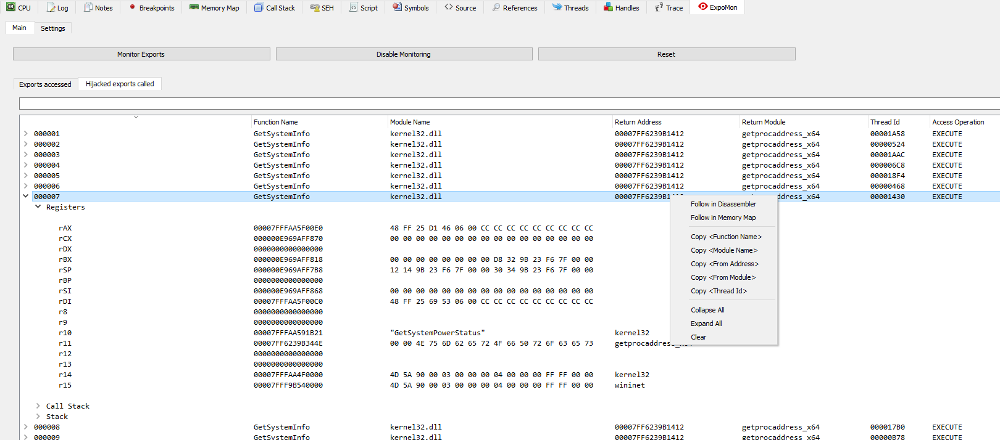

# ExpoMon

ExpoMon is a plugin developed by milCERT.ch, the Swiss Military CERT, for [x64dbg](https://github.com/x64dbg/x64dbg) with the goal to assist the reverse engineer during dynamic analysis of malicious binaries when they resolve APIs, e.g. with `GetProcAddress`, `LdrGetProcedureAddress`, etc. or a custom implementation of those functions. The plugin monitors any access to a cloned memory page of the export directory of every module; `IMAGE_EXPORT_DIRECTORY.AddressOfFunctions` is hijacked and points to the cloned memory page.

## Features

- Logs context information on access to the address of an exported function
- Hijacks accessed exported functions

## Known limitations

- Cannot handle cases where pattern scanning is used to find the functions
- Cannot handle cases where hardcoded relative offsets are used to find the functions
- Cannot handle direct syscalls

# Install

- Download or compile the plugin 
- Copy the plugin to the `plugins` directory
	- `release\x64\plugins\ExpoMon.dp64`
	- `release\x32\plugins\ExpoMon.dp32`
- Set or add `MembpAlt=1` to the `[Engine]` section in `x64dbg.ini`
	- This configures memory breakpoints to use `PAGE_NOACCESS` instead of `PAGE_GUARD`

# Usage

- If it is not visiable in the tabs
	- `Plugins > ExpoMon > Show`
	
- To enable the exports monitoring: `Monitor Exports`
	- This will monitor the access to the exports of all the currently loaded modules
		- In the `Settings` tab it is possible to configure to only monitor specific modules
	- Modules that are loaded at a later stage are also automatically monitored (`CB_LOADDLL`)

- To temporarily disable any monitoring: `Disable Monitoring`
	- Internally executes the `DisableMemoryBreakpoint` command on every monitored memory page
	
- To completely remove and disable the monitoring: `Reset`
	- This may potentially lead to a crash / unhandled exceptions, due to the fact that there may still be pointers in use to the monitored pages, which will be freed, causing invalid memory access
	
- In the `Settings` tab it is possible to configure the conditions for breaking and hijacking
	- The conditions use the internal scripting engine (https://help.x64dbg.com/en/latest/introduction/index.html)
	- Module and function names can be separated by a `,` and `;` or a newline
		- The check performs an `strstr()` so that adding file extensions is not required
		
# Screenshots

# License

MIT License
